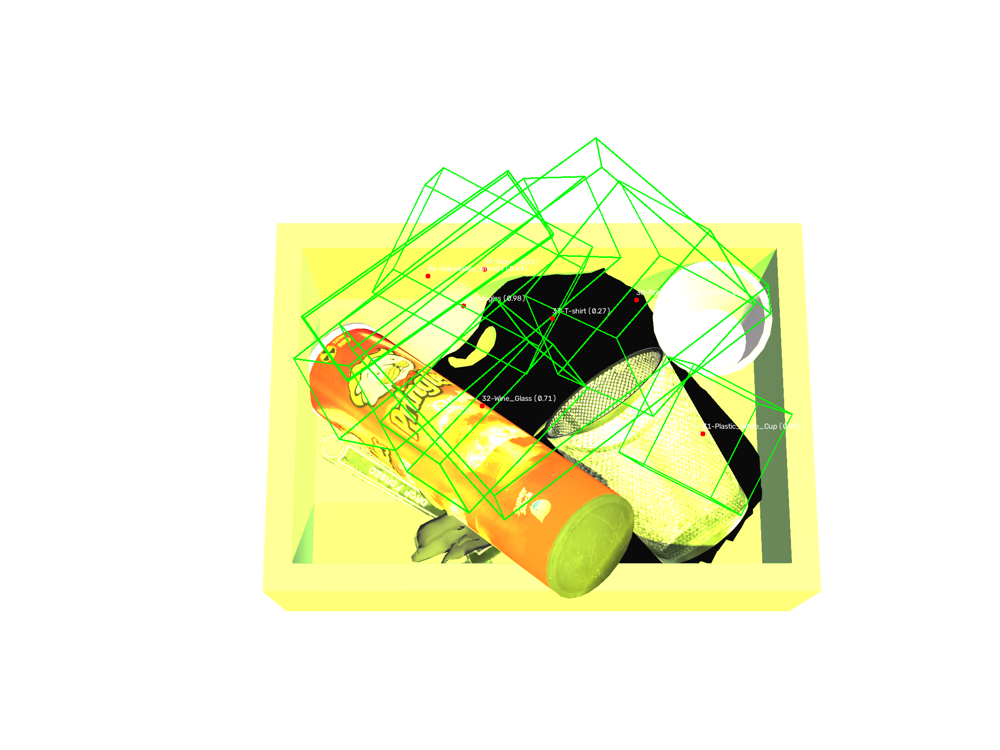
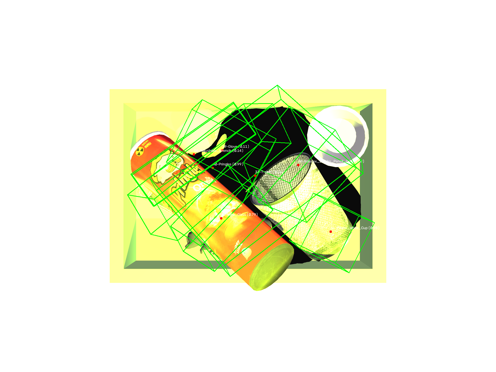
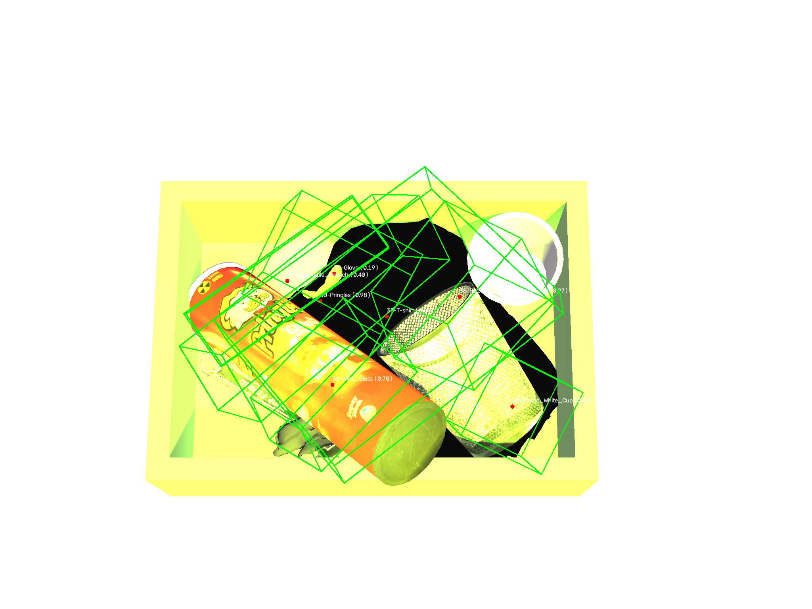

# Warehouse Perception Benchmark

A benchmark suite for evaluating perception, depth estimation, and
grasp-candidate ranking in simulated warehouse picking scenes, built on
top of the CEPB dataset.

## Overview

This project provides tooling to load, annotate, project, and evaluate
3D object cuboids across multi-camera warehouse scenes, along with
downstream detection, depth-quality, and grasp-ranking evaluation
pipelines.

## Highlight: Cuboid Projection Calibration Fix

Fixed a systematic bug where 3D cuboid wireframes rendered crossed and
misaligned against their target objects across left/middle/right camera
views. Root cause was a combination of incorrect cuboid edge topology
and an ambiguous coordinate-handedness convention in the raw dataset,
requiring per-camera empirical calibration.

| Left Camera | Middle Camera | Right Camera |
|---|---|---|
|  |  |  |

- Full writeup: [`docs/postmortems/2026-09-camera-projection-fix.md`](docs/postmortems/2026-09-camera-projection-fix.md)
- Core fix: [`src/warehouse_perception/dataset/projection.py`](src/warehouse_perception/dataset/projection.py)
- Regression test: [`tests/test_projection_calibration.py`](tests/test_projection_calibration.py)

## Highlight: Stereo Depth Fix, Classical Detector, and ROS2 Integration

Fixed a stereo depth estimation bug (`numDisparities` search range too narrow, clipping near objects), validated the fix against ground truth with a per-object error breakdown, and diagnosed why a YOLOv8n fine-tune failed on this dataset (data scarcity) versus why a classical segmentation-based detector succeeded (68% avg recall, 15 scene/camera combos, no training data required). Wrapped the depth pipeline as a live ROS2 node.

- Full writeup: [`docs/postmortems/2026-09-stereo-depth-and-detection.md`](docs/postmortems/2026-09-stereo-depth-and-detection.md)
- Stereo depth fix: [`src/warehouse_perception/depth/stereo.py`](src/warehouse_perception/depth/stereo.py)
- Classical detector: [`src/warehouse_perception/detection/detector.py`](src/warehouse_perception/detection/detector.py)
- ROS2 node: [`ros2/perception_pkg/`](ros2/perception_pkg/)
- Error report: [`scripts/run_report.py`](scripts/run_report.py)

## Project Structure

- `src/warehouse_perception/` — core library (dataset, detection, depth, grasp, evaluation, geometry, ROS nodes)
- `scripts/` — data preprocessing, visualization, and calibration utilities
- `scripts/detection_experiments/` — YOLOv8n fine-tuning experiment (negative result, see postmortem)
- `ros2/perception_pkg/` — ROS2 node wrapping the stereo depth pipeline
- `tests/` — unit, integration, and regression tests
- `configs/` — YAML configs for dataset, detection, depth, grasp, and experiments
- `docs/` — architecture, methodology, results, and postmortems

## Setup

```bash
python -m venv .venv
source .venv/bin/activate
pip install -r requirements.txt
```

## Running Tests

```bash
python -m pytest tests/ -v
```

## Visualizing Annotations

```bash
python scripts/visualize_annotations.py data/raw/cepb/scenes_dev <scene_id> <camera_id>
```

Supported camera IDs: `left`, `middle`, `right`.

## Stereo Depth Error Report

```bash
python scripts/run_report.py
```

## Running the ROS2 Depth Publisher

```bash
export WAREHOUSE_PERCEPTION_ROOT=~/warehouse-perception-benchmark
ln -s $WAREHOUSE_PERCEPTION_ROOT/ros2/perception_pkg ~/ros2_ws/src/perception_pkg
cd ~/ros2_ws && colcon build --packages-select perception_pkg
source install/setup.bash
ros2 run perception_pkg stereo_depth_publisher
```
